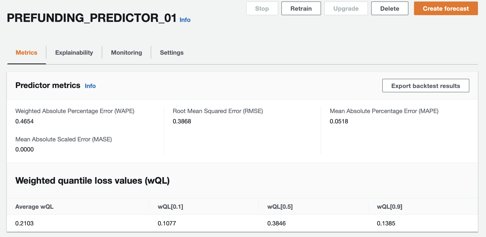
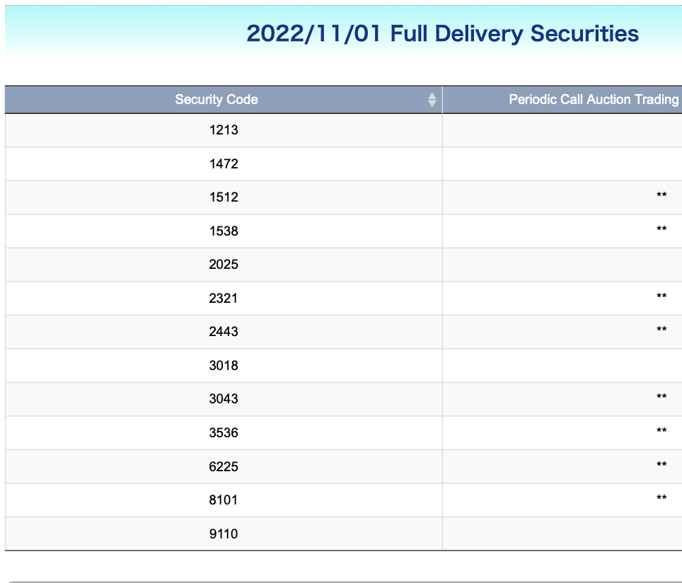
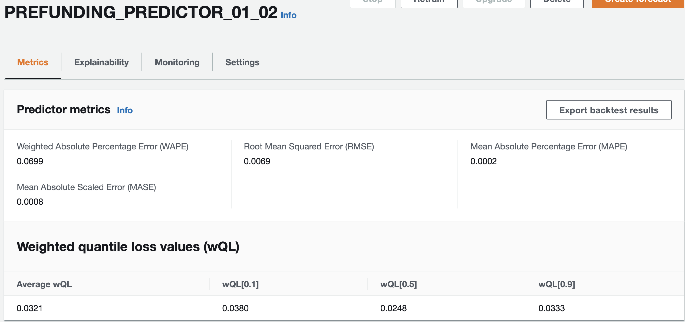

# AWS Machine Learning Engineer Nanodegree - Project Report 

## Definition

### Project Overview

#### Student provides a high-level overview of the project in layman’s terms. Background information such as the problem domain, the project origin, and related data sets or input data is given.
Refer to `proposal.md` or proposal.pdf in this repo.

### Problem Statement

#### The problem which needs to be solved is clearly defined. A strategy for solving the problem, including discussion of the expected solution, has been made.
Refer to `proposal.md` or proposal.pdf in this repo.

### Metrics

#### Metrics used to measure the performance of a model or result are clearly defined. Metrics are justified based on the characteristics of the problem.
Refer to `proposal.md` or `proposal.pdf` in this repo. Subsequent research into timeseries problems and based on the Amazon Forecast service, I will pursue different metrics for success. As explained in the developer documentation, the following evaluation metrics will be available:

    Amazon Forecast produces accuracy metrics to evaluate predictors and help you choose which to use to generate forecasts. Forecast evaluates predictors using Root Mean Square Error (RMSE), Weighted Quantile Loss (wQL), Mean Absolute Percentage Error (MAPE), Mean Absolute Scaled Error (MASE), and Weighted Absolute Percentage Error (WAPE) metrics.

    Amazon Forecast uses backtesting to tune parameters and produce accuracy metrics. During backtesting, Forecast automatically splits your time-series data into two sets: a training set and a testing set. The training set is used to train a model and generate forecasts for data points within the testing set. Forecast evaluates the model's accuracy by comparing forecasted values with observed values in the testing set.

    Forecast enables you to evaluate predictors using different forecast types, which can be a set of quantile forecasts and the mean forecast. The mean forecast provides a point estimate, whereas quantile forecasts typically provide a range of possible outcomes.
   
I will examine all of the above, in particular the Weighted Quantile Loss (wQL). This is because this type of evaluation metrics allows us to incorporate different penalty (weights) to under and over-prediction of different quantiles. As discussed in the `proposal.md`, the cost of a false negative is expected to be greater than the cost of a false positive. Therefore we would rather the model predict a higher probability of inclusion into the exchange's watchlist than lower. Hence we will look at a higher percentile for each forecast, such as P90 or higher. In evaluation we will be focused on the respective wQL, e.g. wQL[90].

## Analysis

### Data Exploration

#### If a dataset is present, features and calculated statistics relevant to the problem have been reported and discussed, along with a sampling of the data. In lieu of a dataset, a thorough description of the input space or input data has been made. Abnormalities or characteristics of the data or input that need to be addressed have been identified.

The full dataset for each table has been provided in the directory `use_this_data`, as well as a few sample rows of data for each data table. Aggregate statistics and a description of the data is provided in `proposal.md`, but in summary the data covers related timeseries for the full universe (approximately 1000 stocks) listed on the Taiwan Stock Exchange, from 1/1/2022 to 10/31/2022.

### Exploratory Visualization

#### A visualization has been provided that summarizes or extracts a relevant characteristic or feature about the dataset or input data with thorough discussion. Visual cues are clearly defined.

Null values were identified withing the notebook `01-EDA.ipynb`. Some are quite expected, in particular short sales volumes, and the watchlist (target) files, as clearly only a small subset of stocks are on the watchlist on any given day.
Due to time constraints, further visual EDA has been forgone.

### Algorithms and Techniques

#### Algorithms and techniques used in the project are thoroughly discussed and properly justified based on the characteristics of the problem.

Based on the documentation from Forecast, the algorithm will train the best predictor among several options. In particular for cases where many related timeseries (e.g. multliple SKUs for a retailer, or in our case multiple stocks on an exchange) whose behavior may have explanatory impact on the other timeseries, deep learning algorithms can be brought to bear to take advantage of this. Amazon's own DeepAR+ and CNN-QR algorithms are used for predicting product demand on Amazon.com, for example. Additionally, both static (non time-varying) item metadata as well as time-varying "related" data sets can be uploaded to Forecast. For example, weather data. In our case we will upload the watchlist data as the target timeseries and the closing price, short sales, p/b, p/e, and volumes data as related data frames.

Additionally, Forecast can be instructed to handle missing values with various strategies. We will discuss that later on.

### Benchmark

#### Student clearly defines a benchmark result or threshold for comparing performances of solutions obtained.

There is no proper benchmark available. The baseline for the front office is to assume that a stock is not on the watchlist until the watchlist is received the following day.

## Methodology

### Data Preprocessing

#### All preprocessing steps have been clearly documented. Abnormalities or characteristics of the data or input that needed to be addressed have been corrected. If no data preprocessing is necessary, it has been clearly justified.

Data was first obtained by downloading from the website as discssed in `proposal.md`. Additional preprocessing was completed in the notebook `twse-scraper.ipynb`:  
- The dataset `stockquotes` required parsing specific lines within a summary file downloaded on a daily basis. 
- As can be seen in the `info` dictionary, for each dataset, the needed columns, data types, and lines to skip at the top or bottom were defined. 
- I had issues with non utf-8 encoded characters which I dealth with by replacing them using the pandas function `read_csv`.
- I concatendated daily files for around 200 days or so into a single pandas dataframe, creating a new column called 'file_date' to indicate which file/date the data was from.
- The Security Code column was not clean so I cleaned it using a regular expression.
- The dataframes were saved as .parquet files.

This data was uploaded to the repository, and subsequently I took additional steps within `01-EDA.ipynb`:

- I ensured a common datetime index of the same length for all data, and exported 4 .parquet files for upload into Amazon Forecast.
- I will deal with missing values direclty in the Forecast api calls.

### Implementation

#### The process for which metrics, algorithms, and techniques were implemented with the given datasets or input data has been thoroughly documented. Complications that occurred during the coding process are discussed.

For general guidance I am refering to the cheatsheet here: https://github.com/aws-samples/amazon-forecast-samples/blob/master/ForecastCheatSheet.md#tutorial :

##### Iterating Models and What-if Best Practices

    Sequentially experiment. It may be tempting to run many experiments in parallel at the same time. But this will prevent you from learning from previous jobs, and in the process, you may miss an experiment that would have worked.

    As you experiment, it is best to keep the same Quantile choices. This is why it is crucial to clarify the Business Requirements up front. Recommended metrics to determine winning experiments are:

    1. Lowest average over all wQLs.  If tie, then:
    2. Lowest WAPE.  If tie, then: 
    3. Lowest RMSE. 
    As a developer or Business leader, here you need to think a little bit like a Data Scientist. A good model, quite often, does not happen on the first try. Machine learning models are only as good as the data put into them, so the data itself very likely may need improvement.

    As mentioned in Step 16, the best strategy is to:

    start simple with just historical data (TTS) and AutoML. From there, you will find out which is the best algorithm for your data.
    For all future experiments, stick to this same algorithm, then use HPO=True. AutoML mode did a light HPO, to verify which algorithm is best, but the parameter optimization is not as deep as explicitly setting HPO toggled on for a single algorithm.
    Finally, when you have finished iterating, use the fixed algorithm and fixed Training Parameters from the last HPO Predictor.
    Iterating and scaling to value. Unlike Machine Learning Competitions, real life POCs are not about "highest accuracy at any cost". In real life, there is often a balance to think about: Accuracy, Scaleability, Effort. Since human time is expensive, there might be other activities of more value than trying to get the utmost extra amounts of accuracy out of Forecast models.

### Refinement

#### The process of improving upon the algorithms and techniques used is clearly documented. Both the initial and final solutions are reported, along with intermediate solutions, if necessary.

For all experiments, I will use a combination of the AWS console and Python SDK. I am choosing to use Auto Predictors, rather than the legacy predictors in Forecast. Per AWS:  

    AutoPredictor is the default and preferred method to create a predictor with Amazon Forecast. AutoPredictor creates predictors by applying the optimal combination of algorithms for each time series in your dataset.

    Predictors created with AutoPredictor are generally more accurate than predictors created with AutoML or manual selection. The Forecast Explainability and predictor retraining features are only available for predictors created with AutoPredictor.

The process I am following is as follows:
- Experiment 01: Train a predictor on target (watchlist) data only. Review accuracy metrics and forecasts.
- Experiment 02: Update the target (watchlist) dataset so that each stock's timeseries reflects a value of zero for non-weekends if the stock is not on the watch list, value of 1 if it is on the watchlist, and missing values for weekends. Upload related datasets of closing prices, trade volumes, short sales volumes, p/e ratios, p/b ratios,  and train new predictor.  Evaluate accuracy.
- Experiment 03: If time allows, upload related dataset for Taiwan stock exchange holidays (need to obtain this data)
- Experiment 04: If time allows, upload shares outstanding item metadata (need to obtain from website), and train new predictor. Evaluate acuracy.

#### Experiment 01
For my first experiment, per the best practices given above by AWS, I decided to start by creating a predictor on the target timeseries (watchlist) only. This will help determine the best algorithm to use in Forecast which I will likely stick with.

I had to go back and format the exported data within `forecast_import` directory, because Forecast expects only 3 columns and no index : `item_id`, `timestamp`, and `target_value`. After doing that I also tried to indicate Taiwan holiday calendar but this wasn't an available choice within the Forecast API, despite there being 66 countries. China wasn't available either. Per the [exhange website](https://www.twse.com.tw/en/holidaySchedule/holidaySchedule), the holiday calendar includes unique holidays such as Chinese New Year, Children's day, and Mid-Autumn/Moon Festival, among others. In a future experiment, according to AWS documentation, we can account for custom holidays through a related timeseries data import in Forecast. Lack of this related data could affect accuracy because watch list data will reflect missing but this is only due to a holiday, rather than other features.

The featurizations used for Experiment-01 are listed below. Back and middle fill are appropriate for the target timeseries, as the null values for the watchlist are either due to weekends, holidays, or due to being not on the watchlist. Note that we will consider re-processing the watchlist dataset because it was constructed with nulls for all 3 instances (weekends, holidays, or not on watchlist), when weekend and holidays should be missing but business days should be the value of zero:  

        {
            "AttributeName": "target_value",
            "Transformations": {
                "aggregation": "sum",
                "backfill": "zero",
                "frontfill": "none",
                "middlefill": "zero"
            }
        }  
        
For aggregation, the default by Forecast is sum. This applies when forecast frequency does not align to the target timeseries frequency. In our case they do align, so summation is not needed. For additional details, refer to docs at https://docs.aws.amazon.com/forecast/latest/dg/how-aggregation-works.html. For in depth on handling missing values in Forecast, see https://docs.aws.amazon.com/forecast/latest/dg/howitworks-missing-values.html.

  

    Weighted Quantile Loss (wQL): [
      {
        "Quantile": 0.9,
        "LossValue": 0.13846153846153844
      },
      {
        "Quantile": 0.5,
        "LossValue": 0.38461538461538464
      },
      {
        "Quantile": 0.1,
        "LossValue": 0.10769230769230768
      }
    ]
    Root Mean Square Error (RMSE): 0.38682272190477407
    Weighted Absolute Percentage Error (WAPE): 0.4653846153846153
    Mean Absolute Percentage Error (MAPE): 0.051818181818181826
    Mean Absolute Scaled Error (MASE): 1e-130`
    
I generated a forecast using the AWS console but noticed that the full universe of stocks wasn't generated by the forecast. See below:  

|   | item_id |                 date | p50 | p90 | p95 |
|--:|--------:|---------------------:|----:|----:|----:|
| 3 |    1213 | 2022-11-01T00:00:00Z | 1.0 | 1.0 | 1.0 |
| 2 |    1418 | 2022-11-01T00:00:00Z | 0.0 | 1.0 | 1.0 |
| 1 |    1472 | 2022-11-01T00:00:00Z | 1.0 | 1.0 | 1.0 |
| 5 |    1512 | 2022-11-01T00:00:00Z | 1.0 | 1.0 | 1.0 |
| 0 |    1538 | 2022-11-01T00:00:00Z | 1.0 | 1.0 | 1.0 |
| 1 |    2025 | 2022-11-01T00:00:00Z | 1.0 | 1.0 | 1.0 |
| 2 |    2321 | 2022-11-01T00:00:00Z | 1.0 | 1.0 | 1.0 |
| 0 |    2364 | 2022-11-01T00:00:00Z | 0.0 | 1.0 | 1.0 |
| 2 |    2443 | 2022-11-01T00:00:00Z | 1.0 | 1.0 | 1.0 |
| 5 |    2841 | 2022-11-01T00:00:00Z | 0.0 | 1.0 | 1.0 |
| 4 |    3018 | 2022-11-01T00:00:00Z | 1.0 | 1.0 | 1.0 |
| 0 |    3043 | 2022-11-01T00:00:00Z | 1.0 | 1.0 | 1.0 |
| 3 |    3229 | 2022-11-01T00:00:00Z | 1.0 | 1.0 | 1.0 |
| 4 |    3383 | 2022-11-01T00:00:00Z | 1.0 | 1.0 | 1.0 |
| 0 |    3494 | 2022-11-01T00:00:00Z | 0.0 | 1.0 | 1.0 |
| 3 |    3536 | 2022-11-01T00:00:00Z | 1.0 | 1.0 | 1.0 |
| 1 |    4414 | 2022-11-01T00:00:00Z | 0.0 | 1.0 | 1.0 |
| 4 |    6225 | 2022-11-01T00:00:00Z | 1.0 | 1.0 | 1.0 |
| 2 |    6289 | 2022-11-01T00:00:00Z | 1.0 | 1.0 | 1.0 |
| 4 |    8101 | 2022-11-01T00:00:00Z | 1.0 | 1.0 | 1.0 |
| 1 |    9110 | 2022-11-01T00:00:00Z | 1.0 | 1.0 | 1.0 |
| 3 |    9928 | 2022-11-01T00:00:00Z | 1.0 | 1.0 | 1.0 |

Calculating the recall based on this single forecast, using (TP / (TP + FN)), we get (13/(13+0)) = 100%. While this seems reassuring, we will proceed with further experimentation. For the front office, the P90 and P95 forecasts would be of highest interest.

#### Experiment 01.2
For this experiment I trained a new predictor on updated watchlist data, and used a forecast horizon of 5 days instead of 1. The updated data relects the need as mentioned above to correctly show 0 value for days that a stock had trading and was on the exchange, but was not on the watchlist. Null values would mean weekends, holidays, and/or the stock began/ended trading on the exchange.

After training the predictor I see a marked improvement in the accuracy metrics:

    Weighted Quantile Loss (wQL): [
      {
        "Quantile": 0.9,
        "LossValue": 0.033315385946153776
      },
      {
        "Quantile": 0.5,
        "LossValue": 0.024813485476922994
      },
      {
        "Quantile": 0.1,
        "LossValue": 0.038043852469230935
      }
    ]
    Root Mean Square Error (RMSE): 0.0069419847508758
    Weighted Absolute Percentage Error (WAPE): 0.06988694954358965
    Mean Absolute Percentage Error (MAPE): 0.00024693699124686194
    Mean Absolute Scaled Error (MASE): 0.0008089736696903767

## Results

### Model Evaluation and Validation

#### The final model’s qualities—such as parameters—are evaluated in detail. Some type of analysis is used to validate the robustness of the model’s solution.

### Justificatiion

#### The final results are compared to the benchmark result or threshold with some type of statistical analysis. Justification is made as to whether the final model and solution is significant enough to have adequately solved the problem.